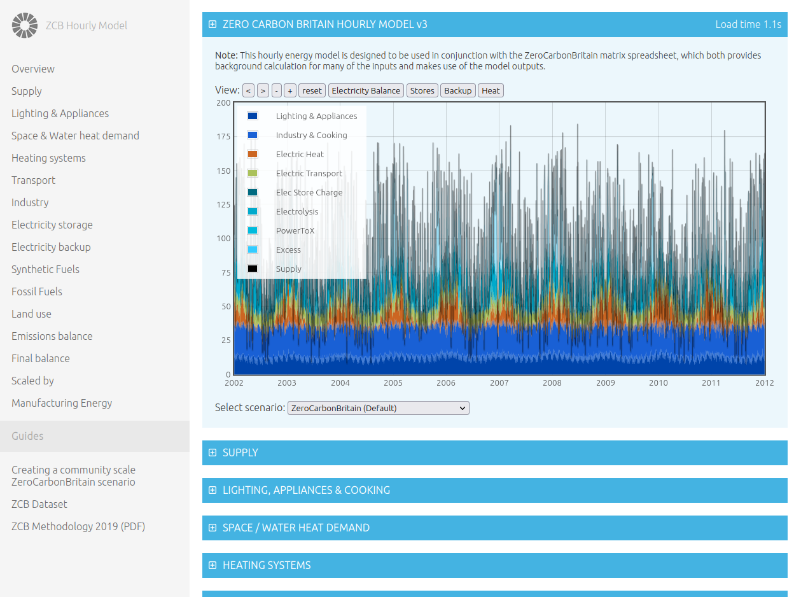

# ZeroCarbonBritain hourly energy model

**A 10-year hourly cross sectoral UK energy model. Build and explore your own zero carbon scenarios.**

The default scenario presented in the tool is the main ZeroCarbonBritain scenario as presented in the reports. The other scenario currently available is a baseline scenario reflecting current energy use and carbon emissions. Both scenarios can be used as starting points from which to explore different variants, either in terms of zero carbon end points or interim steps along the way.

### [Launch online tool: http://openenergymonitor.org/zcem](http://openenergymonitor.org/zcem)

**Zero carbon supply options**

- Variable renewables: Offshore wind, Onshore wind, solar PV & thermal, Wave and Tidal energy. 
- Fixed renewables: Hydro, Geothermal electricity and geothermal heat.
- Nuclear electricity (currently simple flat output)
- Biomass for heat and biomass for synthetic fuels (methane and liquid fuels).
- Backup electricity generation (options include hydrogen, synthetic methane & biomass)

**Demand model**

- Explore: electrification and cross sector integration.
- Domestic and service sector lighting, appliances and cooking demands
- Domestic, service and industry sectors space and water heating demand
- Heating system technologies: Heat pumps, direct electric, boilers (H2, CH4, Biomass, Oil) 
- Transport model
- Industry model
 
**Storage and Synthetic fuels**

- Electricity storage (e.g battery storage or pump hydro)
- Hydrogen production via electrolysis 
- Hydrogen storage (e.g large scale salt caverns)
- Synthetic methane production and storage
- Synthetic liquid fuels production and storage

**Variable renewable dataset**

At the heart of the model is a 10 year hourly offshore wind, onshore wind, solar, wave & tidal dataset, this dataset is derived from hourly weather data mapped to relevant offshore and onshore regions. These datasets are normalised and can be multiplied by an installed capacity in order to provide an expected output for a given installed capacity.

