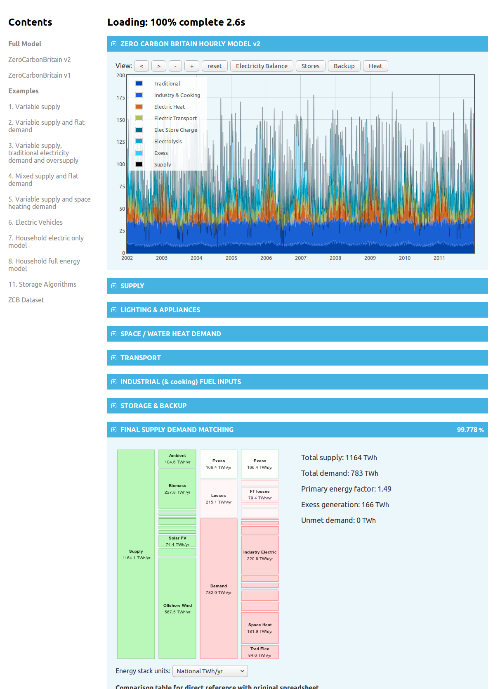

# ZeroCarbonBritain hourly energy model

The ZeroCarbonBritain energy model is a 10-year hourly energy model developed by the ZeroCarbonBritain team at the Centre for Alternative Technology. The hourly model is a component of the wider ZeroCarbonBritain scenario showing how energy demand for transport, heat, industry, services and traditional electricity can be met from a variable renewable supply and biomass based backup system.

The model includes 10 years hourly offshore wind, onshore wind, solar, wave & tidal datasets, these are derived from hourly weather data mapped to relevant offshore and onshore regions. These datasets are normalised and can be multiplied by an installed capacity in order to provide an expected output for a given installed capacity.

On the demand side the model builds up a detailed picture covering everything from lighting, appliances, cooking, water heating, space heating, electric, hydrogen, biofuel vehicles to industrial demand. A multitude of different short term storage technologies are included from heat and battery stores to pump-storage. Longer term backup is provided with gas turbines run on sabatier enhanced biogas combining hydrogen from excess renewable electricity with the CO2 present in biogas to produce larger quantities of methane.

Energy is provided in the form of electricity, hydrogen, liquid biofuel and methane gas to meet the variety of demand types.

### [Launch online tool: http://openenergymonitor.org/zcem](http://openenergymonitor.org/zcem)

